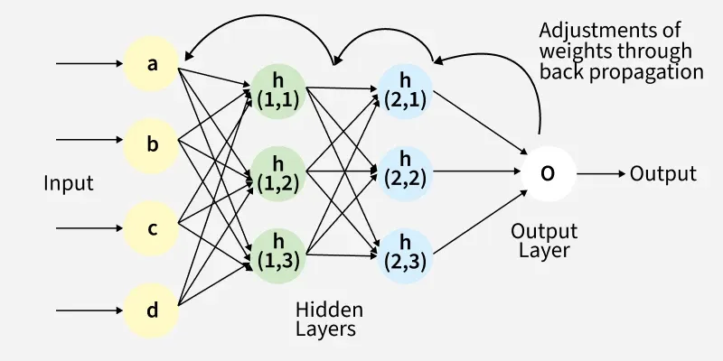

# neural-network-from-scratch-numpy

A fully hand-crafted Multi-Layer Perceptron (MLP) built using only **NumPy** — no PyTorch, no TensorFlow, no autograd. Every forward pass, every gradient, every weight update is written from scratch.

Trained and tested on the **MNIST** handwritten digit dataset. Achieves **~95%+ test accuracy** in under 20 seconds on modern hardware.

---

## Architecture

```
Input (784) → MLP(128) → ReLU → MLP(64) → ReLU → MLP(10) → LogSoftmax → NLLLoss
```



| Layer | Type | Input | Output |
|---|---|---|---|
| 1 | Linear (MLP) | 784 | 128 |
| 2 | ReLU | 128 | 128 |
| 3 | Linear (MLP) | 128 | 64 |
| 4 | ReLU | 64 | 64 |
| 5 | Linear (MLP) | 64 | 10 |
| 6 | LogSoftmax | 10 | 10 |

---

## What's Inside

### `MLP` — Fully Connected Layer
The fundamental building block. Holds weight matrix `W` and bias vector `b`.

- **Forward:** `Z = X @ W.T + b`
- **Backward:** Computes `∂W`, `∂b`, and `∂X` via chain rule
- **Weight Init:** Xavier/Glorot — `scale = √6 / √(din + dout)` — prevents vanishing/exploding gradients at initialization

### `ReLU` — Activation Function
Introduces non-linearity. Without it, stacking layers would still be a single linear transform.

- **Forward:** `f(x) = max(0, x)`
- **Backward:** Passes gradient where `x > 0`, zeros it out where `x ≤ 0`

### `LogSoftmax` — Output Activation
Converts raw logits to log-probabilities. More numerically stable than computing `log(softmax(x))` separately.

- **Forward:** `log_softmax(x) = x - log(Σ exp(x))` — uses `scipy.logsumexp` for stability
- **Backward:** Jacobian = `I - softmax(x)`, applied to incoming gradient

### `NLLLoss` — Loss Function
Negative Log Likelihood. Paired with `LogSoftmax` this gives standard cross-entropy loss.

- **Forward:** `loss = -Σ log_prob[correct_class]`
- **Backward:** Gradient is `-1` at the correct class index, `0` elsewhere

### `SequentialNN` — Network Container
Chains all layers together. Inspired by PyTorch's `nn.Sequential`.

- **Forward:** Passes input left → right through all blocks
- **Backward:** Passes gradient right → left (reverse order) — chain rule

### `Optimizer` — SGD
Updates only `MLP` layer parameters (`W` and `b`). `ReLU` and `LogSoftmax` have no learnable parameters.

- **Rule:** `W = W - lr * ΔW` and `b = b - lr * Δb`

### `train()` — Training Loop
Mini-batch Stochastic Gradient Descent over `nb_epochs` steps.

Each epoch:
1. Sample random mini-batch from training data
2. Forward pass → get predictions
3. Compute loss
4. Backward pass → compute gradients
5. Optimizer step → update weights

---

## Hardware & Performance Benchmark

Pure NumPy means all computation runs on CPU. Benchmarked on two different CPU architectures:

| Hardware | Architecture / Backend | Epochs | Speed | Time |
|:---|:---|:---|:---|:---|
| **AMD Ryzen 3 3100** (4C/8T @ 3.9GHz) | x86-64 (Zen 2) / Intel oneDNN + OpenBLAS (AVX2) | 5000 | ~311 it/s | ~15.0 sec |
| **Apple M1 SoC** (8-Core: 4P+4E) | ARM64 / Apple Accelerate (AMX + NEON) | 5000 | ~1104 it/s | **4.55 sec** |

**Key Takeaways:**
- M1 is ~3.5x faster than Ryzen 3 3100 on this workload
- M1's Apple Accelerate framework routes matrix math through dedicated AMX coprocessor
- Neural network training is memory-bandwidth bound — M1's Unified Memory Architecture gives it a significant edge over standard DDR4 desktop setups
- Accuracy variation between runs is due to random weight initialization and random mini-batch sampling, not hardware

---

## Results

| Epochs | Batch Size | Learning Rate | Test Accuracy |
|---|---|---|---|
| 5000 | 128 | 0.01 | ~95.73% |

---

## Usage

```bash
# 1. Clone
git clone https://github.com/YOUR_USERNAME/neural-network-from-scratch-numpy.git
cd neural-network-from-scratch-numpy

# 2. Create virtual environment
python -m venv venv
source venv/bin/activate       # Linux / macOS
venv\Scripts\activate          # Windows

# 3. Install dependencies
pip install numpy tqdm scipy tensorflow

# 4. Run
python nn.py
```

---

## Dependencies

| Package | Purpose |
|---|---|
| `numpy` | All matrix operations (forward/backward passes) |
| `scipy` | `logsumexp` for numerically stable LogSoftmax |
| `tensorflow` / `keras` | Only used to download the MNIST dataset |
| `tqdm` | Progress bar during training |

> **Note:** TensorFlow is used solely as a convenient MNIST data loader. It plays no role in training or inference.

---

## Project Structure

```
nn_from_scratch/
├── nn.py        # Full implementation — all layers, training loop, evaluation
└── README.md
```

---

## License

MIT
